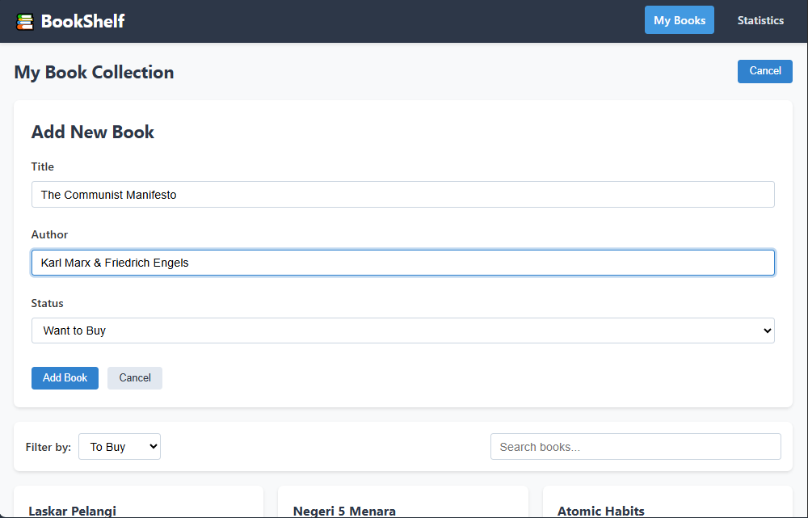
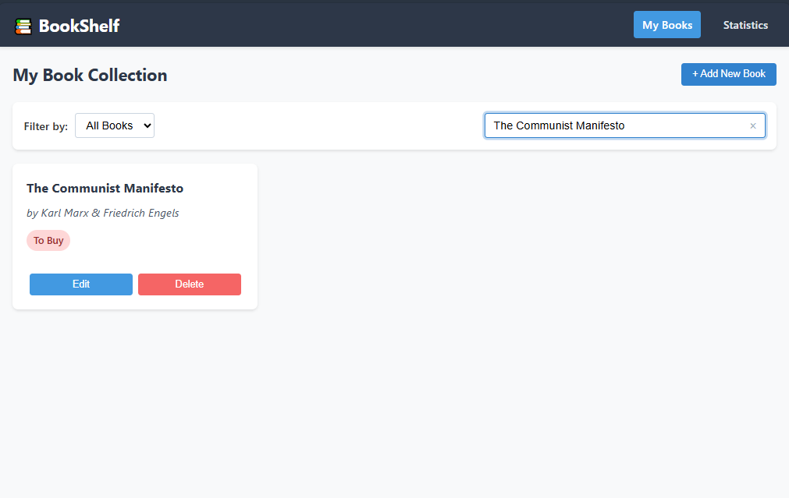
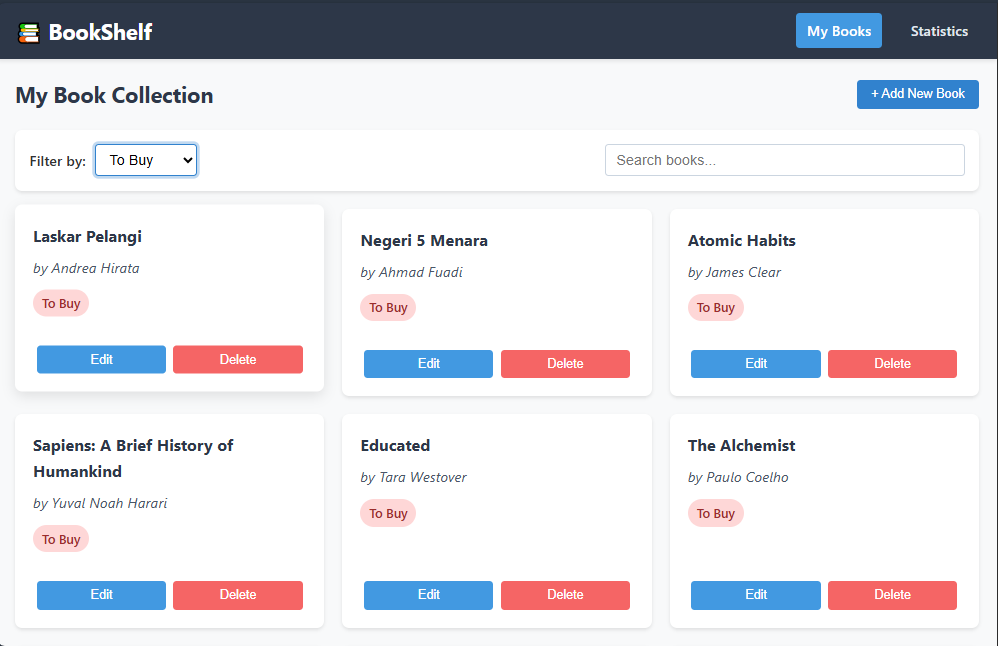
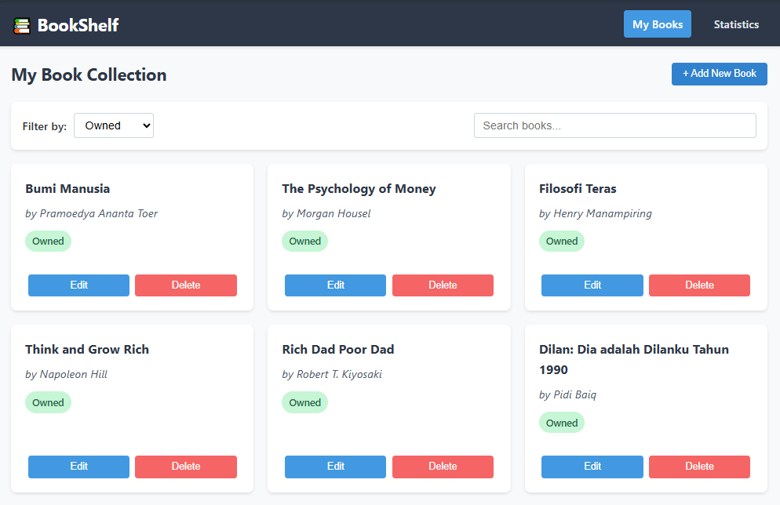
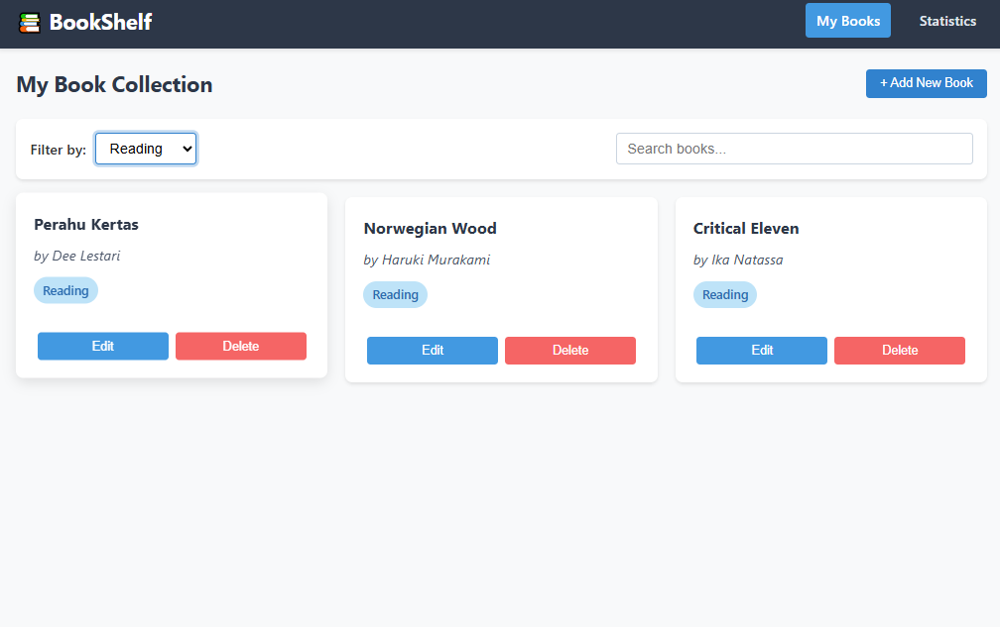
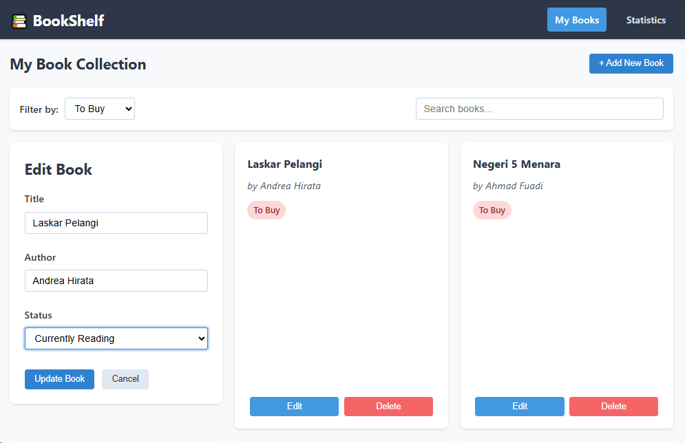
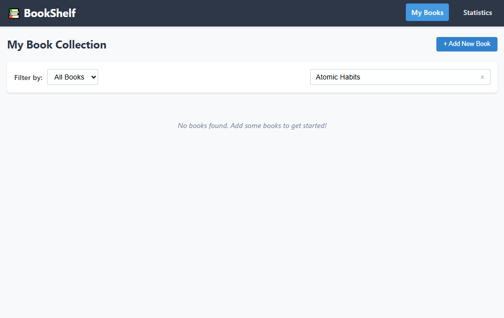

# Bookshelf — Aplikasi Manajemen Buku Pribadi

Bookshelf adalah aplikasi berbasis React untuk mencatat dan mengelola koleksi buku pribadi. Aplikasi ini memungkinkan pengguna untuk menambahkan buku yang dimiliki, sedang dibaca, atau ingin dibeli. Data disimpan secara lokal menggunakan `localStorage`, sehingga tetap tersimpan meskipun browser ditutup.

## Fitur Utama

-  Menambah buku baru (judul, penulis, dan status: milik/baca/beli)
-  Mengedit dan menghapus data buku
-  Pencarian buku berdasarkan judul/penulis
-  Filter buku berdasarkan status
-  Halaman statistik jumlah buku per kategori
-  Data tersimpan otomatis menggunakan `localStorage`

##  Struktur Komponen

### `BookForm`
Komponen form yang digunakan untuk menambah atau mengedit buku. Fitur:
- Validasi input (judul dan penulis wajib diisi)
- Opsi untuk memilih status: `All`, `Owned`, `On Reading`, dan `Want to Buy`
- Gunakan `useState` untuk kontrol form
- Gunakan error handling untuk input yang kosong

###  `BookList`
Menampilkan daftar buku dalam bentuk kartu atau tabel. Fitur:
- Tampilkan data buku dari global state
- Responsif terhadap pencarian dan filter
- Tombol edit dan hapus per item

###  `BookFilter`
Komponen untuk memfilter buku berdasarkan status:
- Dropdown untuk memilih: All, Owned, On Reading, Want to Buy
- Update state global agar `BookList` menampilkan hasil sesuai filter

### Penggunaan UseState
`useState` digunakan untuk mengelola state lokal dalam komponen, seperti:
- Input judul & penulis buku
- Status dropdown filter
- Input pencarian

### Penggunaan Context
`BookProvider`

### Penggunaan Custom Hook
`UseBookStorage`
`UseBookStats`
 Selain itu, aplikasi ini menggunakan **Custom Hooks** untuk memisahkan logika yang digunakan berulang kali. Beberapa custom hook yang digunakan di antaranya adalah `useLocalStorage` untuk menyimpan data ke localStorage, `useBookStorage` untuk mengelola data buku, dan `useBookStats` untuk menghitung statistik kategori buku.

### Penggunaan Routing dengan React Router
Untuk mengatur navigasi antar halaman, aplikasi ini menggunakan **React Router**. Halaman utama dapat diakses melalui `/` dan halaman statistik melalui `/stats`.

### Penggunaan Prototypes
Aplikasi ini juga menggunakan **PropTypes** untuk memvalidasi tipe data props yang dikirimkan ke komponen, sehingga membantu mencegah error akibat tipe data yang salah.

### Penyimpanan Data dengan localStorage
Data buku disimpan secara lokal di browser menggunakan **localStorage**, sehingga data tetap tersimpan meskipun aplikasi ditutup dan dibuka kembali.

### Pengujian dengan React Testing
Pengujian aplikasi dilakukan menggunakan **React Testing** untuk memastikan bahwa komponen-komponen aplikasi berfungsi dengan baik sesuai dengan yang diharapkan. Dalam hal ini menggunakan **useBookStats.test.js** dan **useBookStorage.test.js** untuk kedua *hook* custom.

---

##  Teknologi yang Digunakan

- [React.js](https://reactjs.org/)
- [React Router](https://reactrouter.com/)
- [Context API](https://reactjs.org/docs/context.html)
- [PropTypes](https://www.npmjs.com/package/prop-types)
- [React Testing Library](https://testing-library.com/)
- CSS

---

## Instalansi dan Running

# Clone repository
git clone https://github.com/reynaldi116/pemrograman_web_itera_122140116.git

cd bookshelf-app

# Instal dependensi
npm install

# Jalankan aplikasi secara lokal
npm start

### Screenshot

> (Tambahkan tangkapan layar tampilan aplikasi)

### Tampilan Awal

### Tampilan Menambahkan Buku

### Tampilan Mencari Buku

### Tampilan Filter List Buy

### Tampilan Filter List Owned

### Tampilan Filter List On Reading

### Tampilan Bar Statistic

### Tampilan Edit Buku

### Tampilan Delete Buku

